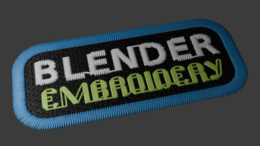

# Blender Embroidery Import

This is a Blender add-on that allows you to import files to be used with embroidery machines as curves with optional geometry (thickness) via a bevel or geometry nodes. It also detects and displays the color of your threads.

## License
This addon is free to use (see [license](LICENSE)), including commercially, but if you find it useful please consider supporting my free and open source projects:

## Credit and supported file types
This addon relies heavily on [pyembroidery](https://pypi.org/project/pyembroidery/) and should support the same file formats as that library. You can find the whole list of supported file types in the pyembroidery [documentation](https://pypi.org/project/pyembroidery/). 

Personally I've only tested it with `.pes` files which I've created using the [Ink/Stitch addon](https://inkstitch.org/) for [Inkscape](https://inkscape.org/).

## Example file
The pattern shown at the top of this page can be found here: [example.pes](example.pes). The original `.svg` file is [here](example.svg), open it in Inkscape with the Ink/Stitch addon installed.

## Table of contents
- [Blender Embroidery Import](#blender-embroidery-import)
  - [Installation](#installation)
  - [Import settings](#import-settings)
    - [Import jump wires](#import-jump-wires)
    - [Create material](#create-material)
    - [Create collection](#create-collection)
    - [Thickness type](#thickness-type)
      - [No thickness (curve only)](#no-thickness-curve-only)
      - [Using geometry nodes](#using-geometry-nodes)
      - [Using bevel](#using-bevel)
    - [Thread thickness](#thread-thickness)
  - [Info on the material and color](#info-on-the-material-and-color)

## Installation
Download the [latest release](https://github.com/javl/blender-embroidery/releases/latest) as a `.zip` file and add it via Blender's add-on manager.

After installation you can find the importer in the file menu under `File > Import > Embroidery Import`.

## Import settings
In the import dialog there are a few settings you can adjust:

### Import jump wires
Whether to include jump wires in the imported object. Jump wires are lines that the machine creates when jumping to the next part of your pattern and which you normally remove manually. Not importing them leads to a cleaner look, but will not completely accurate to the original pattern.

### Create material
With this selected a material will be created for the imported object. This material will reflect the colors of the threads used in the embroidery file.

### Create collection
With this enabled all generated curves for your import will be place in a single collection.

### Thickness type
There are three options here:

#### No thickness (curve only)
This will use curves to draw your shape, but will not add any thickness to it. This is useful if you want to use the embroidery as a curve in your scene but not show the actual lines in renders.

#### Using geometry nodes
This will create a node setup that adds a thickness to the imported curves using a `Curve to mesh` node with a `Curve circle` as the profile

#### Using bevel
This will have a similar effect as the `Using geometry nodes` option, but will use the bevel property of the curve object to add thickness instead of a geometry node

### Thread thickness
This value determines the thickness of the thread in the imported object. Not available when using the `No thicness (curve only) thickness type.

## Info on the material and color
Each of the generated curves as a custom attribute called `thread_number` which corresponds to the color of the thread used in the embroidery file.
These colors are all placed in a `Color ramp` in the material, which is then used to color the curves based on its `thread_number` attribute.

